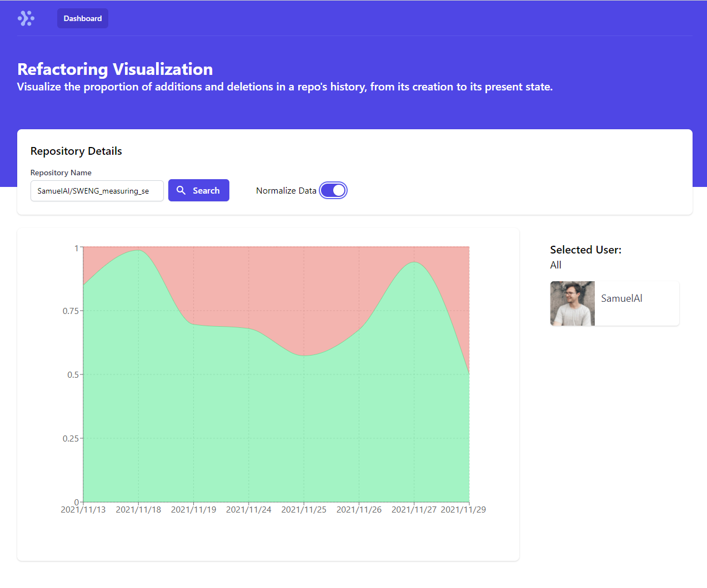
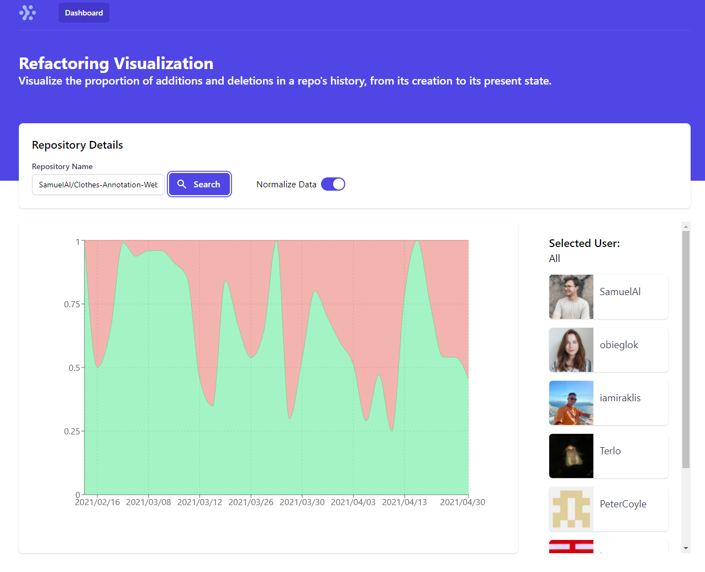
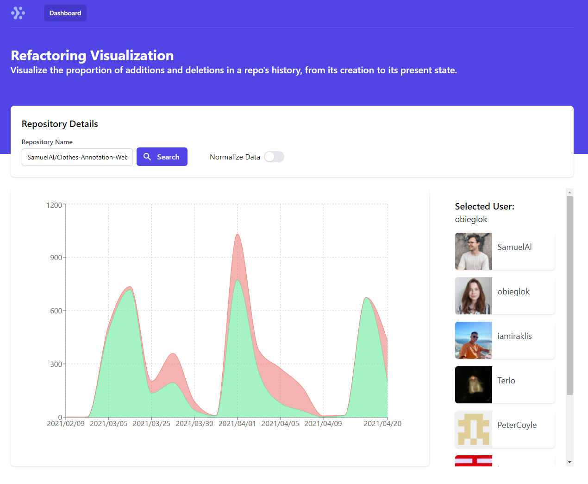

# SWENG Measuring Engineering Project

**Author**: Samuel Alarco Cantos

## Introduction

The aim of the project was to create a visualization of some engineering metric we were interested in using the Github API. 

During my experience as a Google STEP intern, I learned of the importance of a proper test-driven software engineering process, and how a lot of the work of a software engineer revolves around maintaining, improving and testing existing code. Commits are not necessarily new code, but rather refactoring of code. In fact, it is often not a good sign if a project's history only consists of new code, with no refactoring and improving (often pruning unnecessary code). I was interested in how this process applies to repos in Github, specially to my own projects. Some questions I was interested in were:

- How does the cycle of new code/refactoring evolve over time?
- Is there a period in a repo's history in which only new code is added, followed by a period in which mainly refactoring maintenance is done?
- Is code addition and refactoring done by different people or by the same contributor? 

## Solution

Answering these questions accurately would require quite sophisticated analysis of a repo's data, for which I did not have as much time as I wanted. But an initial metric I looked at was the proportion between additions and deletions of lines of across commits, calculated for each contributor and also aggregated for all contributors. 

This was interesting when used on repos with many contributors. It became clear that there were some people that mainly contributed new code, while a handful of individuals not only contributed but had an even ratio between additions and deletions, indicating that they were rewriting code (refactoring). Also, deletions often increased towards the end of the project, as code was being cleaned up.

## Features

My solution takes in a repo name and aggregates the number of additions and deletions per commit across time. The results can be viewed for the whole repo (aggregating all contributors), or for each contributor. 

Given that initial commits that set up a project can be disproportionally large and overshadow further data-points in the graph, there is an option to normalize the data. This shows ratios of additions and deletions instead of actual line count, and helps to flatten spikes.

## Running the Project

The project stack consists of a React.js web frontend, a Python Flask backend that takes care of the data gathering and processing, and a MongoDB database that caches and stores processing results for fast retrieval if a query is repeated. The stack can be run using docker-compose.

Before running the project, we need a Github API token. For ease of use, this can be placed in a .env file in the root directory (same directory as *docker-compose.yml*), and docker-compose will take care of distributing the token to the necessary places.

The .env file should look like this

```
TOKEN=ghp_ghjsk38rjslfg94j423459fj # Substitute with your token
```

Once the .env file is in place, and assuming you have docker installed on your machine, you can simply run on a terminal opened in the project´s root directory:

```console
docker compose up
```

Once the stack is up and running, point your browser to *localhost:3000* to access the project´s frontend! Just type the full name of a repository in the search bar eg. *SamuelAl/SWENG_measuring_se*, and wait for the results. The first time a query is made it can take a while for the data to be processed (around 1-2 mins for a normal student´s group project repo, depending on the size of the repo). Further queries should be practically instant as the results are cached in MongoDB.

## Screenshots

Normalized view of repo with a single contributor.



Normalized view of repo with multiple contributors.



Standard view of a single contributor in a repo with multiple contributors.



## Technologies Used

This is the list of technologies and resources used to make this project possible.

### Frontend

- React.js
- npm
- craco
- Rechart.js
- Tailwind CSS
- TailwindUI
- HeadlessUI
- Heroicons
- nginx

### Backend

- Python
- Flask
- jsonpickle
- pytest
- PyGithub
- pymongo

### Database

- MongoDB


